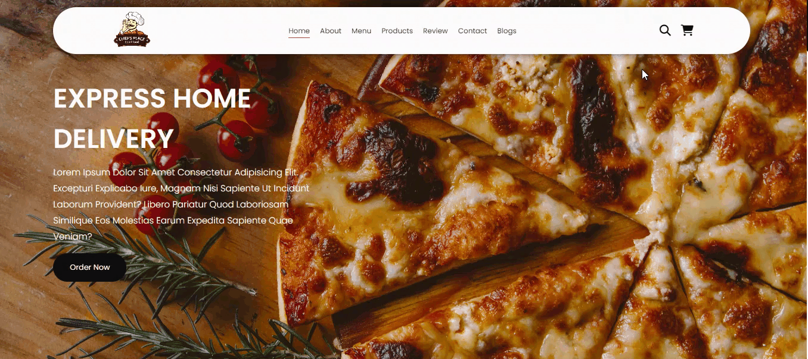

<h1> restaurantwebsite </h1>

This project represents a restaurant website designed using Html, Css, and JavaScript technologies. Modern design elements, responsive functionality, and impressive visuals enhance the user experience, allowing customers to effortlessly explore menu options and access relevant information.

<h2> the technologies used in the project </h2>

It was coded using HTML, CSS, and JavaScript technologies.

<h2> Screenshot </h2>

# restaurantweb
# restaurantweb
# restaurantweb
